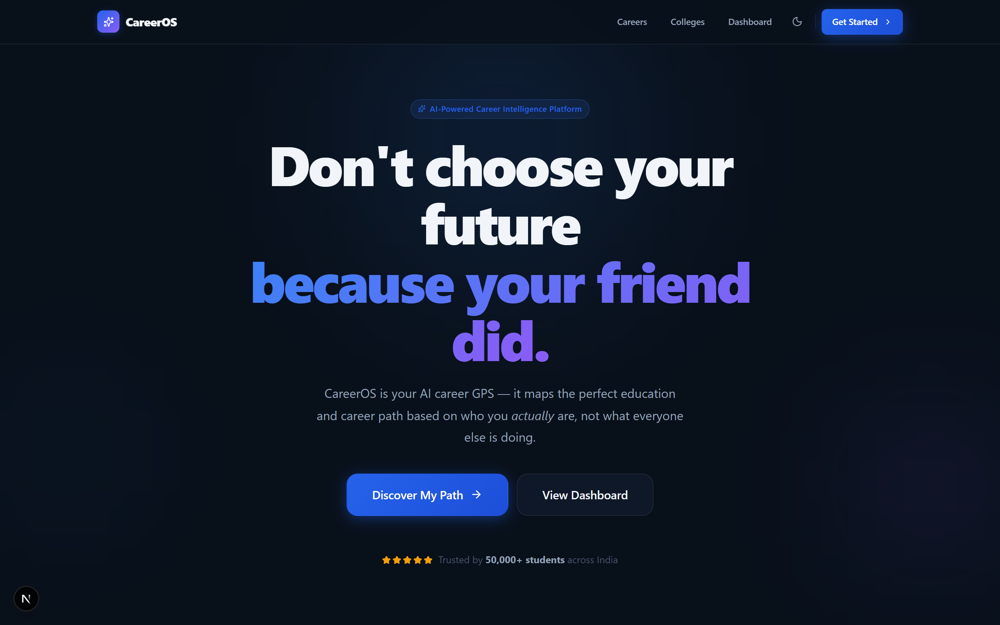
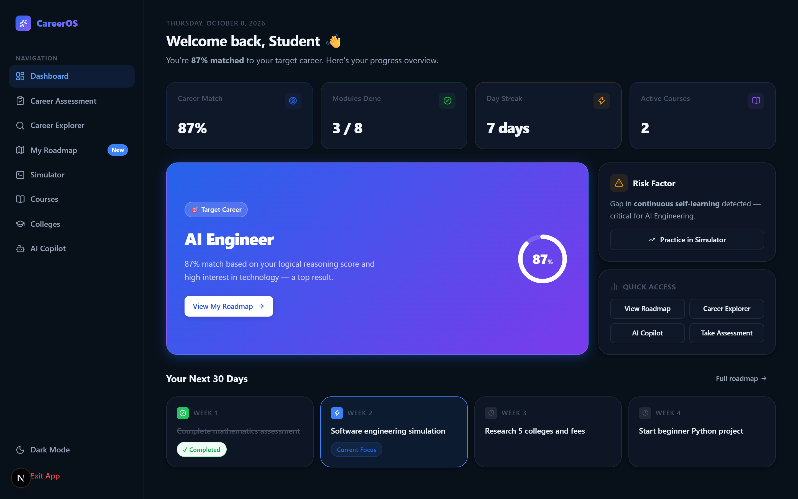
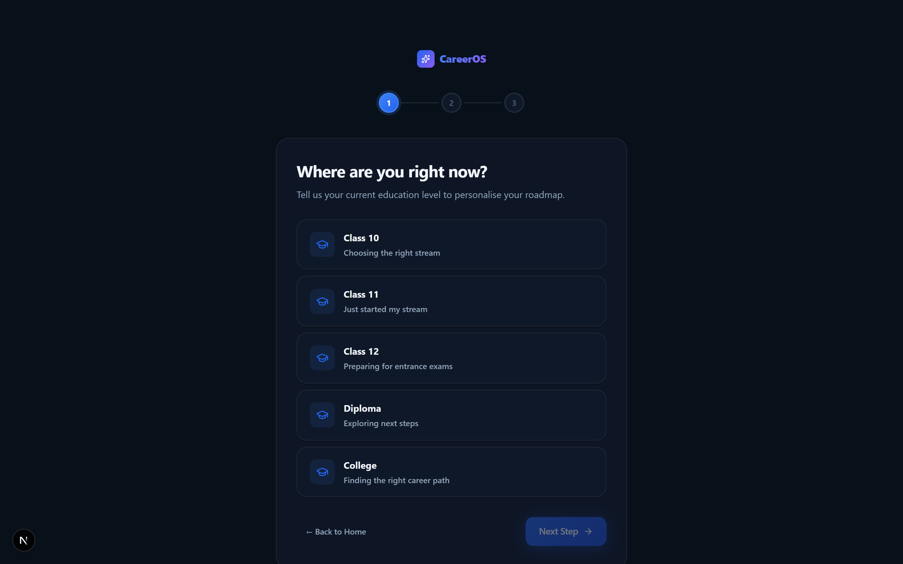
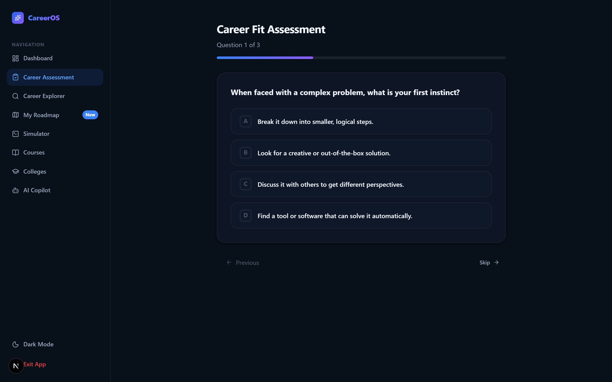
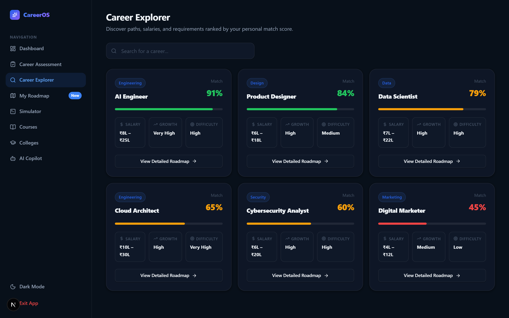
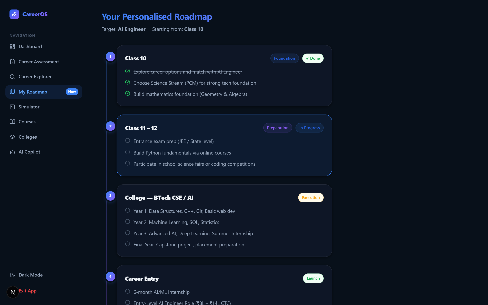
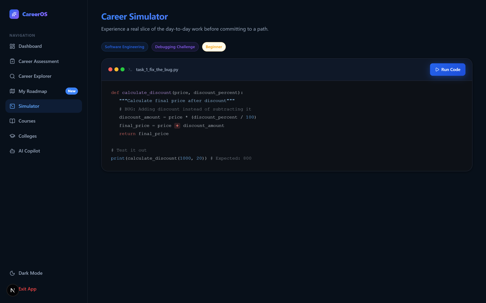
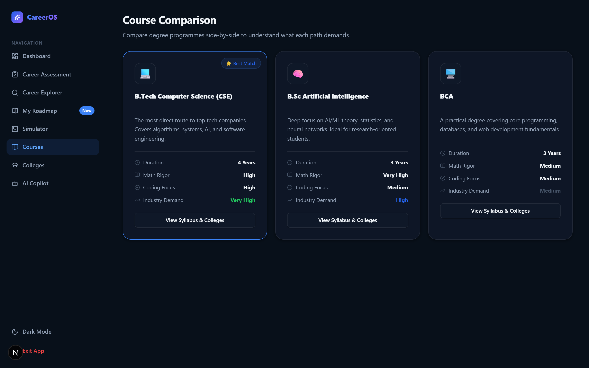
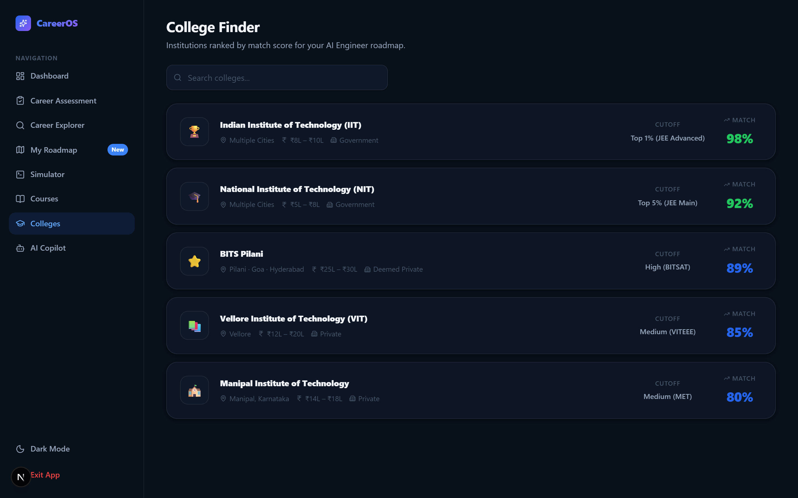
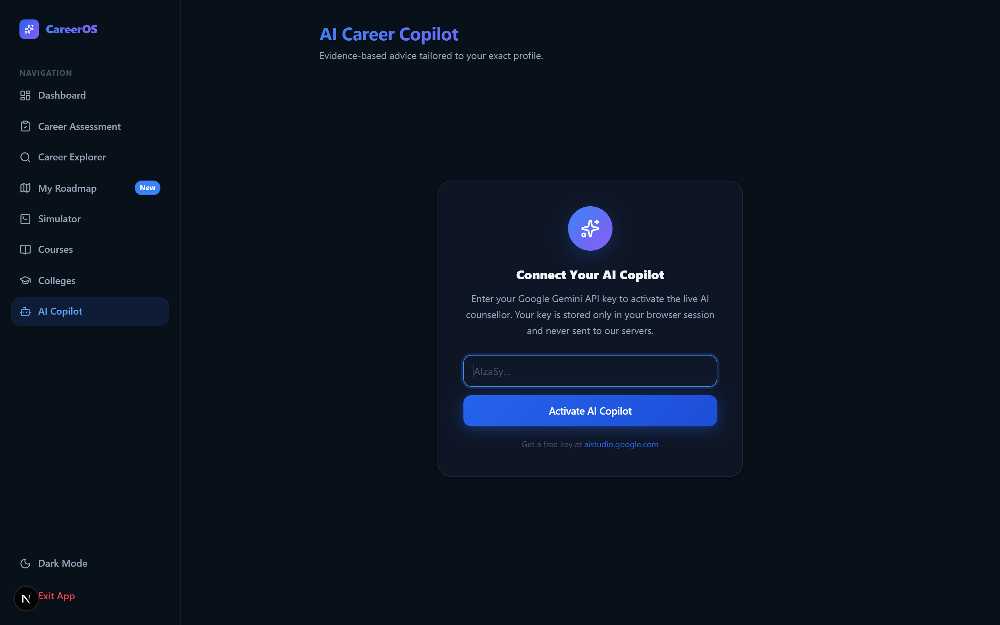

<div align="center">


# CareerOS — AI-Powered Career GPS for Students

**Stop choosing your future because your friend did.**

CareerOS is a production-ready, AI-powered career guidance platform built for Indian students (Class 10 → College). It analyses your academic profile, interests, and reasoning style to generate a personalised step-by-step roadmap to your dream career.

[](https://nextjs.org)
[](https://react.dev)
[](https://typescriptlang.org)
[](https://tailwindcss.com)
[](https://framer.com/motion)
[](https://aistudio.google.com)

</div>

---

## ✨ Features

| Module | Description |
|---|---|
| 🏠 **Landing Page** | Animated hero, stats bar, feature cards, how-it-works, CTA banner |
| 🧭 **Onboarding** | 3-step animated flow — education level → stream → profile creation |
| 📊 **Dashboard** | Career match score ring, stat cards, risk factor, 30-day action plan |
| 🎯 **Career Assessment** | Multi-question personality + aptitude test with instant results |
| 🔍 **Career Explorer** | Searchable career cards with match %, salary, growth, difficulty |
| 🗺️ **My Roadmap** | Personalised timeline from current class to target career entry |
| 💻 **Career Simulator** | Interactive code debugging challenge — experience real engineering work |
| 📚 **Course Comparison** | Side-by-side degree comparison (BTech CSE, B.Sc AI, BCA) |
| 🏛️ **College Finder** | Searchable ranked college list with match scores, fees, cutoffs |
| 🤖 **AI Copilot** | Live chat with Google Gemini 1.5 Flash for personalised career advice |

---

## 🖥️ Screenshots

### 🏠 Landing Page

> Animated hero, stats bar, 3 feature cards, "How it works" section, gradient CTA banner

### 📊 Dashboard

> Career match score ring, stat cards, risk alert, quick-access grid, 30-day action plan

### 🧭 Onboarding

> 3-step animated flow — education level → stream → profile creation

### 🎯 Career Assessment

> Multi-question aptitude test with progress bar and instant results

### 🔍 Career Explorer

> Searchable career cards with match %, salary, growth rate, and difficulty

### 🗺️ My Roadmap

> Personalised timeline from current class to career entry with done/active/pending states

### 💻 Career Simulator

> Interactive code debugging challenge — experience real day-to-day engineering work

### 📚 Course Comparison

> Side-by-side degree comparison with duration, math rigor, coding focus, demand

### 🏛️ College Finder

> Searchable ranked college list with match scores, fees, cutoffs, and type

### 🤖 AI Copilot

> Live Gemini 1.5 Flash chat with starter prompts and animated message bubbles

---

## 🚀 Getting Started

### Prerequisites

Make sure you have the following installed:

| Tool | Version | Download |
|---|---|---|
| **Node.js** | v18 or higher | [nodejs.org](https://nodejs.org) |
| **npm** | v9 or higher | Comes with Node.js |
| **Git** | Any recent version | [git-scm.com](https://git-scm.com) |

---

### 1. Clone the Repository

```bash
git clone https://github.com/manthnnnn/CarrierOS.git
cd CarrierOS
```

---

### 2. Install Dependencies

```bash
npm install
```

This installs all dependencies including:
- Next.js 16.4 (with Turbopack)
- React 19
- Tailwind CSS v4
- Framer Motion 14
- Lucide React icons
- Google Generative AI SDK
- next-themes (dark/light mode)

---

### 3. Environment Variables (Optional — for AI Copilot)

The AI Copilot feature uses Google Gemini 1.5 Flash. You can either:

**Option A — Enter it in the browser UI** (recommended, no setup needed):
1. Run the app
2. Go to `/copilot`
3. Paste your Gemini API key in the input field
4. Your key is stored only in your browser session

**Option B — Create a `.env.local` file** (for developers):

```bash
# Create the file
cp .env.example .env.local
```

```env
# .env.local
NEXT_PUBLIC_GEMINI_API_KEY=your_gemini_api_key_here
```

> 🔑 Get a free Gemini API key at [aistudio.google.com/app/apikey](https://aistudio.google.com/app/apikey)

---

### 4. Run the Development Server

```bash
npm run dev
```

Open [http://localhost:3000](http://localhost:3000) in your browser.

> If port 3000 is busy, Next.js will automatically use port 3001. Check the terminal output for the exact URL.

---

### 5. Build for Production

```bash
npm run build
```

Expected output:
```
✓ Compiled successfully
✓ Collecting page data
✓ Generating static pages (11/11)
Route (app)
├ ○ /
├ ○ /assessment
├ ○ /careers
├ ○ /colleges
├ ○ /copilot
├ ○ /courses
├ ○ /dashboard
├ ○ /onboarding
├ ○ /roadmap
└ ○ /simulator
```

---

### 6. Start Production Server

```bash
npm run start
```

---

## 🗂️ Project Structure

```
career-roadmap/
├── src/
│   ├── app/
│   │   ├── layout.tsx           # Root layout with ThemeProvider
│   │   ├── page.tsx             # Landing page (/)
│   │   ├── globals.css          # Premium design system (CSS custom properties)
│   │   ├── dashboard/
│   │   │   └── page.tsx         # Main dashboard
│   │   ├── onboarding/
│   │   │   └── page.tsx         # 3-step onboarding flow
│   │   ├── assessment/
│   │   │   └── page.tsx         # Career fit assessment
│   │   ├── careers/
│   │   │   └── page.tsx         # Career explorer with search
│   │   ├── roadmap/
│   │   │   └── page.tsx         # Personalised roadmap timeline
│   │   ├── simulator/
│   │   │   └── page.tsx         # Career simulator (code challenge)
│   │   ├── courses/
│   │   │   └── page.tsx         # Course comparison
│   │   ├── colleges/
│   │   │   └── page.tsx         # College finder
│   │   └── copilot/
│   │       └── page.tsx         # AI career copilot (Gemini)
│   └── components/
│       ├── Sidebar.tsx          # Premium frosted-glass sidebar
│       ├── DashboardLayout.tsx  # Sidebar + main content layout
│       ├── ThemeProvider.tsx    # next-themes wrapper
│       └── PlaceholderPage.tsx  # Coming-soon page component
├── public/                      # Static assets
├── postcss.config.mjs           # PostCSS config (Tailwind v4)
├── next.config.ts               # Next.js config with Turbopack
├── tailwind.config.ts           # Tailwind configuration
├── tsconfig.json                # TypeScript config
└── package.json
```

---

## 🎨 Design System

CareerOS uses a fully custom CSS design system inspired by Apple's iOS/macOS design language:

### Color Tokens
```css
--brand-500: #3B82F6    /* Primary blue */
--accent-500: #8B5CF6   /* Violet accent */
--success-500: #22C55E  /* Green */
--warning-500: #F59E0B  /* Amber */
--danger-500: #EF4444   /* Red */
```

### Dark Mode
Dark mode is fully supported via `next-themes`. Toggle it using the moon/sun icon in the nav or sidebar. The dark theme uses deep navy backgrounds (`#08101A`) with careful contrast ratios for readability.

### Glass Morphism
Cards use `backdrop-filter: blur()` with semi-transparent backgrounds for a premium frosted glass effect — especially visible in dark mode.

---

## 🤖 AI Copilot Setup

1. Visit [Google AI Studio](https://aistudio.google.com/app/apikey)
2. Sign in with your Google account
3. Click **"Create API Key"**
4. Copy the key (starts with `AIzaSy...`)
5. In CareerOS, go to `/copilot` and paste the key
6. Start chatting with your personal career advisor

> The AI is prompted to act as an expert, empathetic Indian student career counsellor. It gives structured, encouraging, realistic advice.

---

## 🛠️ Tech Stack

| Technology | Version | Purpose |
|---|---|---|
| [Next.js](https://nextjs.org) | 16.4 | React framework with App Router |
| [React](https://react.dev) | 19 | UI library |
| [TypeScript](https://typescriptlang.org) | 5 | Type safety |
| [Tailwind CSS](https://tailwindcss.com) | v4 | Utility-first CSS |
| [Framer Motion](https://framer.com/motion) | 14 | Animations & transitions |
| [Lucide React](https://lucide.dev) | 1.53 | Icon library |
| [next-themes](https://github.com/pacocoursey/next-themes) | 0.4 | Dark/light mode |
| [Google Generative AI](https://ai.google.dev) | 0.24 | Gemini AI SDK |
| [Recharts](https://recharts.org) | 3 | Charts (available for extension) |
| [Zustand](https://zustand-demo.pmnd.rs) | 5 | State management (available for extension) |

---

## 📦 Available Scripts

```bash
npm run dev      # Start development server with Turbopack
npm run build    # Build for production
npm run start    # Start production server
npm run lint     # Run ESLint
```

---

## 🚢 Deployment

### Deploy to Vercel (Recommended)

1. Push your code to GitHub
2. Go to [vercel.com](https://vercel.com) and import your repository
3. Click **Deploy** — zero configuration needed
4. Your app will be live at `https://your-app.vercel.app`

### Deploy to Netlify

```bash
npm run build
# Upload the .next folder or connect your GitHub repo
```

### Docker

```dockerfile
FROM node:18-alpine
WORKDIR /app
COPY package*.json ./
RUN npm ci --only=production
COPY . .
RUN npm run build
EXPOSE 3000
CMD ["npm", "start"]
```

---

## 🗺️ Roadmap

- [ ] User authentication (NextAuth.js)
- [ ] Database persistence (Prisma + PostgreSQL)
- [ ] Full 10-question assessment with weighted scoring algorithm
- [ ] Real API integrations (college data, job listings)
- [ ] PDF roadmap export
- [ ] Progress tracking with analytics charts
- [ ] Mobile app (React Native)
- [ ] Multi-language support (Hindi, Tamil, Telugu)

---

## 🤝 Contributing

1. Fork the repository
2. Create a feature branch: `git checkout -b feat/your-feature`
3. Commit your changes: `git commit -m "feat: add your feature"`
4. Push to the branch: `git push origin feat/your-feature`
5. Open a Pull Request

---

## 📄 License

MIT License — see [LICENSE](LICENSE) for details.

---

## 👨‍💻 Author

Built with ♥ for every ambitious student in India.

**CareerOS** — *Your AI-Powered Career GPS*

[](https://github.com/manthnnnn/CarrierOS)

---

<div align="center">
  <strong>⭐ Star this repo if CareerOS helped you!</strong>
</div>
